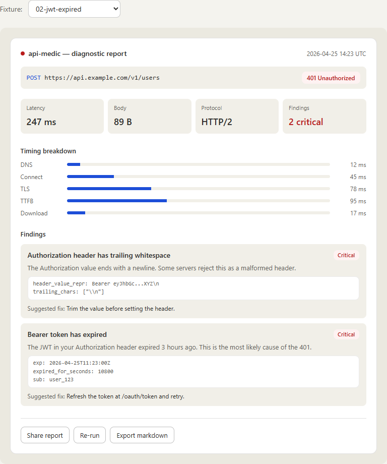
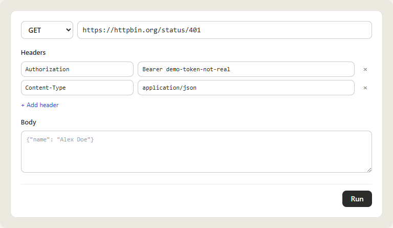
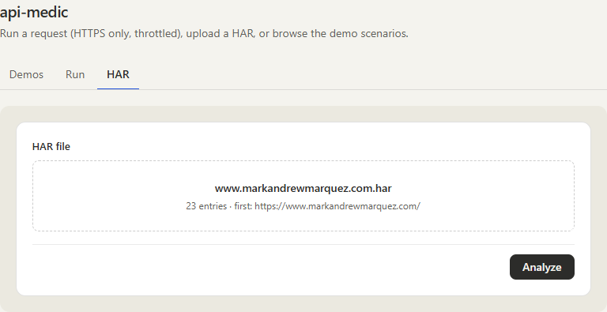
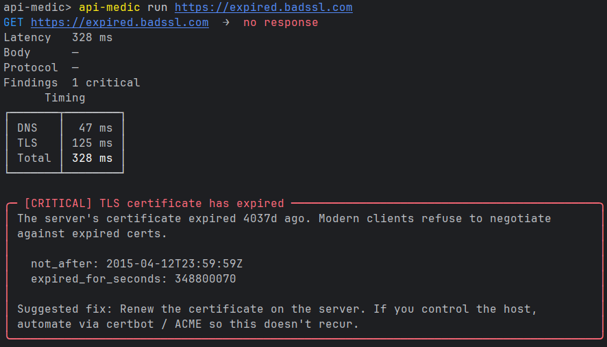
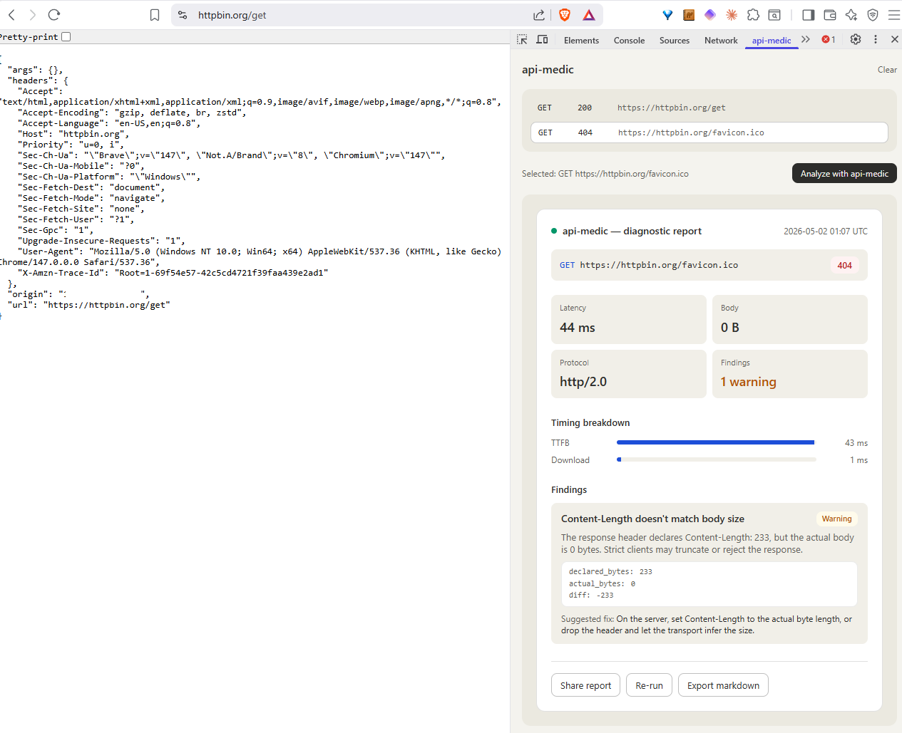

# api-medic

A diagnostic tool for HTTP API issues. Paste a curl, upload a HAR, or fire a live request — get a structured report with plain-language findings across DNS, TLS, redirects, CORS, auth, body, and rate limiting.

## Try it now

[**api-medic.markandrewmarquez.com**](https://api-medic.markandrewmarquez.com) — no install. The **Demos** tab has eight pre-built scenarios; the **Run** tab fires a live request from the browser (HTTPS-only, SSRF-guarded, throttled); the **HAR** tab takes any HAR export from DevTools.







## What gets checked

20 diagnostic checks across five categories. IDs are stable and namespaced so you can filter, suppress, or reference individual findings without coupling to the human-readable title.

| Category | Checks |
|---|---|
| **Network & transport** (6) | `network.dns.no_records`, `network.dns.slow`, `network.tls.expired`, `network.tls.expiring_soon`, `network.tls.weak_protocol`, `network.tls.cn_mismatch` |
| **HTTP semantics** (5) | `http.cors.misconfigured`, `http.headers.duplicate`, `http.redirect.loop`, `http.redirect.too_many`, `http.redirect.protocol_downgrade` |
| **Auth** (4) | `auth.missing`, `auth.jwt.expired`, `auth.jwt.not_yet_valid`, `auth.header.whitespace` |
| **Body / content** (3) | `body.malformed_json`, `body.content_length_mismatch`, `body.encoding_mismatch` |
| **Rate limiting** (2) | `rate_limit.hit` (429 + Retry-After context), `rate_limit.approaching` (`X-RateLimit-Remaining` < 10% of limit) |

JWT signatures aren't verified — claims are decoded for `exp` / `nbf` checks only. Signature verification needs the issuer's secret/public key, which is out of scope for a client-side diagnostic.

See [`docs/architecture.md`](docs/architecture.md) for the full check spec, evidence shape, and design rationale per check.

## Install

```bash
pip install api-medic
```

Requires Python 3.10+. The wheel includes the local web UI bundle — no separate frontend install.

## Quickstart

```bash
# Bare URL — shorthand for `api-medic run`
api-medic https://api.example.com/v1/users

# Full request: method, headers, body
api-medic run https://api.example.com/v1/users \
    --method POST \
    --header "Authorization: Bearer ..." \
    --header "Content-Type: application/json" \
    --body '{"name": "Alex Doe"}'

# Analyze a curl command (defaults to executing it)
api-medic from-curl 'curl -X GET https://api.example.com/v1/users -H "Authorization: Bearer ..."'

# Analyze a captured HAR file (no execution)
api-medic from-har session.har

# Launch the local web UI on http://localhost:8765
api-medic serve
```

Output flags: `--output {terminal,json,markdown,html}` (default `terminal`), `--save <path>`, `--no-color`, `--verbose`.



## Surfaces

Four ways to use it, all powered by the same core engine — every surface produces a byte-identical `Report` given the same input.

```
            ┌────────┐  ┌──────────────┐  ┌─────────────┐  ┌─────────────────┐
            │  CLI   │  │ Local web UI │  │ Hosted demo │  │ Browser ext     │
            └───┬────┘  └──────┬───────┘  └──────┬──────┘  └────────┬────────┘
                │              │                 │                  │
                ▼              ▼                 ▼                  ▼
        ┌────────────────────────────────────────────────────────────────┐
        │                    api_medic.core.engine                       │
        │   parser  ·  runner (httpx + dnspython + cryptography)  ·      │
        │   20 checks  ·  renderers (terminal · json · markdown · html)  │
        └────────────────────────────────────────────────────────────────┘
                                      │
                                      ▼
                              Pydantic Report
```

- **CLI** — `pip install api-medic`, full feature set, four output formats.
- **Local web UI** — `api-medic serve` runs the same engine behind a browser frontend at `http://localhost:8765`. No outbound calls except to the target you're diagnosing.
- **Hosted demo** — [api-medic.markandrewmarquez.com](https://api-medic.markandrewmarquez.com). Captured (HAR/curl) and live-run modes. Live runs are HTTPS-only, SSRF-guarded, and throttled (2 req/sec, burst 5). Stateless — no payload is persisted; see [`PRIVACY.md`](PRIVACY.md).
- **Browser extension** — Chrome / Firefox MV3 DevTools panel that captures requests in-browser and posts them to the hosted analyzer. See [`extension/README.md`](extension/README.md) for source-install instructions.



## Architecture

A pure-Python core engine (parser + runner + 20 checks + four renderers) wrapped by four surfaces. The Lambda surface ships the runner alongside an SSRF guard for live requests; FastAPI / uvicorn are excluded so the cold-start budget stays intact even with `httpx`, `dnspython`, and `cryptography` shipped. The browser extension is a thin capture layer — analysis runs server-side on the hosted Lambda, which is why the same `Report` component renders identically in the panel and on the hosted demo.

See [`docs/architecture.md`](docs/architecture.md) for the full v1 spec, including the Pydantic data model, per-check rationale, and AWS deployment topology.

## Contributing

Issues and PRs welcome at [github.com/marky224/api-medic](https://github.com/marky224/api-medic). Quality gates enforced in CI: `pytest`, `ruff check . && ruff format --check .`, `mypy`, and `make types` to keep the TypeScript types in sync with the Pydantic models.

## License

MIT — see [LICENSE](LICENSE).
